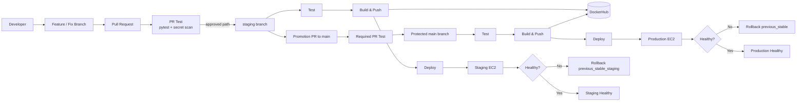

# TechFlow CI/CD Pipeline

> Automated CI/CD for a containerized Flask application with staging and production deployments, immutable Docker image tags, health validation, automatic rollback, secret scanning, email notifications, and enforced pull-request governance on `main`.

**Implementation status:** Complete and validated  
**Primary workflow:** `.github/workflows/pipeline.yml`  
**Runtime:** Docker on AWS EC2  
**Container registry:** DockerHub

---

## Table of Contents

- [Overview](#overview)
- [What This Project Demonstrates](#what-this-project-demonstrates)
- [Architecture](#architecture)
- [Branch and Promotion Model](#branch-and-promotion-model)
- [CI/CD Pipeline](#cicd-pipeline)
- [Docker Image Strategy](#docker-image-strategy)
- [Deployment and Health Validation](#deployment-and-health-validation)
- [Automatic Rollback](#automatic-rollback)
- [Security and Repository Governance](#security-and-repository-governance)
- [Validation Evidence](#validation-evidence)
- [Repository Structure](#repository-structure)
- [Run Locally](#run-locally)
- [Required GitHub Secrets](#required-github-secrets)
- [EC2 Runtime Requirements](#ec2-runtime-requirements)
- [Operational Runbook](#operational-runbook)
- [Failure Behaviour](#failure-behaviour)
- [Production-Readiness Assessment](#production-readiness-assessment)
- [Known Limitations](#known-limitations)
- [Future Improvements](#future-improvements)
- [Project Outcome](#project-outcome)

---

## Overview

TechFlow began as a CI/CD implementation challenge for a small Python Flask application. The application itself is intentionally simple; the engineering focus is the delivery system around it.

The completed implementation provides a controlled delivery path from source code to AWS EC2:

1. Validate application behaviour with automated tests.
2. Scan the repository for committed secrets.
3. Build a Docker image only after validation succeeds.
4. Publish both a channel tag and an immutable commit-SHA tag to DockerHub.
5. Deploy `staging` and `main` to separate EC2 targets.
6. Preserve the currently running image before replacement.
7. Perform post-deployment health checks.
8. Automatically restore the previous stable image if the new release is unhealthy.
9. Keep the deployment pipeline failed even when rollback succeeds, so a failed release is never reported as successful.
10. Enforce pull-request based changes to protected `main` with a dedicated required `PR Test` status check.

The result is a small, understandable end-to-end delivery system that demonstrates CI/CD reliability, rollback engineering, environment promotion, artifact traceability, and repository governance.

---

## What This Project Demonstrates

| Capability | Implementation |
|---|---|
| Continuous Integration | `pytest` runs automatically in GitHub Actions |
| Pull-request validation | Dedicated `PR Test` check on PRs to `staging` and `main` |
| Secret scanning | TruffleHog scans committed repository history/content |
| Containerization | Python 3.12 slim image |
| Registry publishing | DockerHub |
| Immutable artifact traceability | Docker image tagged with the Git commit SHA |
| Environment channels | `staging` and `latest` image tags |
| Environment separation | Separate staging and production EC2 deployment targets |
| Stable-image preservation | Running image retagged before replacement |
| Health verification | `/health` checked with bounded retries |
| Automatic rollback | Previous stable image restored on unhealthy deployment |
| Rollback verification | Restored container must itself pass health validation |
| Correct failure semantics | Failed release remains a failed pipeline after successful rollback |
| Notifications | Success/failure email notifications |
| Protected production branch | Pull request required for `main` |
| Required production CI gate | `PR Test` required before protected merge |
| Admin enforcement | Branch protection applies to repository administrators |
| Force-push protection | Force pushes to `main` disabled |
| Branch deletion protection | Deletion of `main` disabled |

---

## Architecture



### Runtime deployment path

```text
GitHub
  │
  ├── pull_request
  │      └── PR Test
  │             ├── application tests
  │             └── committed-secret scan
  │
  └── push: staging | main
         │
         ├── Test
         │      ├── pytest
         │      └── TruffleHog
         │
         ├── Build & Push
         │      ├── build channel image
         │      ├── build immutable SHA image
         │      └── push both to DockerHub
         │
         └── Deploy
                ├── upload deployment scripts to EC2
                ├── preserve running stable image
                ├── pull candidate image
                ├── replace container
                ├── health check
                ├── success → keep candidate
                └── failure → automatic rollback + verify recovery
```

---

## Branch and Promotion Model

### `staging`

`staging` is the pre-production integration branch.

A successful push to `staging` runs the complete pipeline:

```text
Test → Build & Push → Deploy to staging EC2
```

Docker tags used by staging:

```text
staging
<GIT_COMMIT_SHA>
previous_stable_staging
```

### `main`

`main` represents the production release branch and is protected.

The expected promotion path is:

```text
feature/fix branch
      ↓
pull request
      ↓
staging
      ↓
full staging deployment validation
      ↓
promotion pull request
      ↓
required PR Test
      ↓
main
      ↓
full production deployment
```

Docker tags used by production:

```text
latest
<GIT_COMMIT_SHA>
previous_stable
```

### Pull requests

For pull-request events:

- `PR Test` runs.
- `Build & Push` is skipped.
- `Deploy` is skipped.

This prevents an unmerged pull request from publishing or deploying an image while still making the CI validation status available as a branch-protection gate.

---

## CI/CD Pipeline

The workflow is defined in:

```text
.github/workflows/pipeline.yml
```

It triggers for pushes and pull requests targeting `main` or `staging`.

### Job 1 — Test / PR Test

The test job:

- checks out the repository with full history;
- configures Python 3.12;
- installs dependencies;
- executes `pytest test_app.py -v`;
- scans for committed secrets with TruffleHog;
- sends a test-stage failure email on failed push workflows.

Display name behaviour:

```text
push         → Test
pull_request → PR Test
```

The unique `PR Test` name is intentional. It gives `main` branch protection an unambiguous status check to require before merge.

### Job 2 — Build & Push

Runs only for push events and only after the test job succeeds.

The job:

1. authenticates to DockerHub;
2. selects the environment channel tag;
3. builds the Docker image;
4. tags it with both the channel and commit SHA;
5. pushes the channel image;
6. pushes the immutable commit-SHA image;
7. sends a build-stage failure notification if necessary.

Branch-to-channel mapping:

| Branch | Channel tag |
|---|---|
| `staging` | `staging` |
| `main` | `latest` |

### Job 3 — Deploy

Runs only after Build & Push succeeds.

The deployment job:

- selects the correct EC2 target based on branch;
- uploads `health_check.sh`, `rollback.sh`, and `tag_stable.sh` to `/home/ubuntu`;
- validates that the scripts exist;
- sets script permissions to `750`;
- authenticates the host to DockerHub;
- preserves the current stable image;
- pulls the candidate image;
- replaces the application container;
- publishes host port `80` to container port `5000`;
- runs the post-deployment health check;
- automatically invokes rollback if validation fails;
- sends success/failure deployment notifications.

The application container runs with:

```text
--restart unless-stopped
--publish 80:5000
```

---

## Docker Image Strategy

The registry repository follows this pattern:

```text
<DOCKERHUB_USERNAME>/techflow-app
```

Each successful push build produces two tags.

### Staging

```text
techflow-app:staging
techflow-app:<GIT_COMMIT_SHA>
```

### Production

```text
techflow-app:latest
techflow-app:<GIT_COMMIT_SHA>
```

The commit-SHA tag provides traceability between:

```text
Git commit
    ↓
GitHub Actions run
    ↓
Docker image
    ↓
deployment
```

### Rollback tags

Before replacement, the currently running container image is preserved as:

```text
staging    → previous_stable_staging
production → previous_stable
```

On the first deployment, where no running `techflow-app` container exists, stable-image tagging is safely skipped.

---

## Deployment and Health Validation

The Flask application exposes:

```text
GET /
GET /health
```

The health endpoint returns HTTP `200` with:

```json
{"status":"ok"}
```

`scripts/health_check.sh` performs a bounded retry loop:

- default maximum attempts: `5`;
- default interval: `5` seconds;
- request timeout: `10` seconds;
- success criterion: HTTP `200`;
- success exit code: `0`;
- exhausted retries exit code: `1`.

The deployment is considered successful only when the candidate container passes this post-deployment check.

---

## Automatic Rollback

Rollback is deliberately treated as a recovery mechanism, not as a successful release.

### Deployment sequence

```text
Preserve current running image
        ↓
Pull candidate image
        ↓
Remove old container
        ↓
Start candidate
        ↓
Run /health validation
        ↓
   ┌────┴────┐
 Healthy   Unhealthy
   │           │
   │           ├── capture failed container logs
   │           ├── remove failed container
   │           ├── pull previous stable image
   │           ├── start rollback container
   │           └── verify rollback health
   │
   └── deployment succeeds
```

### Critical failure semantics

If the candidate is unhealthy but rollback succeeds:

```text
service state  → recovered
pipeline state → FAILED
```

This is intentional. The previous version being restored does not make the attempted release successful.

If the rollback image also fails health validation, the deployment reports a critical rollback failure and exits non-zero.

### Validated rollback behaviour

A controlled staging failure test demonstrated that:

1. the previous stable image was preserved;
2. the new candidate failed all health-check attempts;
3. rollback started automatically;
4. the stable image was restored;
5. the restored application returned HTTP `200`;
6. the pipeline still ended in failure because the attempted release itself was unhealthy.

This is the intended fail-safe behaviour.

---

## Security and Repository Governance

### Repository and workflow security controls

The implementation includes:

- GitHub Secrets for credentials and keys;
- no plaintext deployment credentials in the workflow;
- minimal workflow permission of `contents: read`;
- committed-secret scanning with TruffleHog;
- DockerHub access-token authentication;
- SSH private-key authentication to EC2;
- `docker login --password-stdin` on the remote host;
- immutable commit-SHA image tags;
- separate staging and production host secrets;
- protected `main` branch;
- required PR-specific CI gate.

### `main` branch protection

The validated branch-protection baseline is:

| Control | State |
|---|---|
| Pull request required | Enabled |
| Required status check | `PR Test` |
| Require branch to be up to date | Enabled (`strict: true`) |
| Enforce for administrators | Enabled |
| Dismiss stale reviews | Enabled |
| Required approving reviews | `0` |
| Require conversation resolution | Enabled |
| Force pushes | Disabled |
| Branch deletion | Disabled |

The approval count is intentionally `0` for this single-maintainer portfolio repository. The required PR workflow and CI gate are still enforced.

### Enforcement validation

Branch protection was tested with a controlled, non-destructive validation branch.

A direct attempt to push the validation commit to `main` was rejected by GitHub with:

```text
GH006: Protected branch update failed for refs/heads/main.
Changes must be made through a pull request.
Required status check "PR Test" is expected.
```

The same commit was then pushed to a temporary branch and opened through PR #8. `PR Test` succeeded, while PR Build & Push and Deploy remained correctly skipped. The validation PR was closed without merging and the temporary branch was deleted.

---

## Validation Evidence

The final implementation was validated through both positive and negative paths.

| Evidence | Identifier | Outcome |
|---|---:|---|
| Healthy staging baseline | Run `32307348069` attempt 2 | Passed |
| Controlled staging failure / rollback | Run `32316928174` (#19) | Candidate failed; rollback succeeded; run correctly remained failed |
| Post-test staging recovery | Run `32320068989` (#20) | Passed |
| Production baseline promotion | PR #5 | Merged |
| Initial production deployment | Run `32322373950` (#22) | Passed |
| PR-specific check-name validation | PR #6 | `PR Test` passed; Build/Deploy skipped |
| Post-governance staging deployment | Run `32383340932` (#24) | Test, Build & Push, Deploy passed |
| Governance promotion | PR #7 | Merged |
| Governance production deployment | Run `32387300238` (#26) | Test, Build & Push, Deploy passed |
| Protected-branch enforcement test | PR #8 | Direct push rejected; PR Test passed; PR closed without merge |

### Final production evidence

Production Run `32387300238` executed against merge commit:

```text
5d30a3e7c6361d94a4bbda74439665d1d0aa4af3
```

Final job state:

```text
Test          → success
Build & Push  → success
Deploy        → success
```

Deployment steps confirmed:

```text
Upload deployment scripts to EC2 → success
Deploy application over SSH      → success
Send deployment success email    → success
Send deployment failure email    → skipped
```

---

## Repository Structure

```text
Techflow-Project/
├── .github/
│   └── workflows/
│       └── pipeline.yml
├── scripts/
│   ├── health_check.sh
│   ├── rollback.sh
│   └── tag_stable.sh
├── .gitignore
├── app.py
├── Dockerfile
├── README.md
├── requirements.txt
└── test_app.py
```

### Key files

| File | Purpose |
|---|---|
| `app.py` | Flask application and `/health` endpoint |
| `test_app.py` | Automated application tests |
| `Dockerfile` | Container image definition |
| `.github/workflows/pipeline.yml` | CI/CD orchestration |
| `scripts/health_check.sh` | Post-deployment and rollback health validation |
| `scripts/tag_stable.sh` | Preserves currently running image as rollback target |
| `scripts/rollback.sh` | Restores and verifies previous stable image |

---

## Run Locally

### Prerequisites

- Python 3.12+
- `pip`
- Docker

### Install dependencies

```bash
python -m pip install --upgrade pip
pip install -r requirements.txt
```

### Run tests

```bash
pytest test_app.py -v
```

### Run the application

```bash
python app.py
```

Application:

```text
http://localhost:5000
```

Health endpoint:

```text
http://localhost:5000/health
```

### Build and run with Docker

```bash
docker build -t techflow-app:local .
docker run --rm -p 5000:5000 --name techflow-app techflow-app:local
```

Then verify:

```bash
curl http://localhost:5000/health
```

Expected response:

```json
{"status":"ok"}
```

---

## Required GitHub Secrets

Sensitive values are stored in GitHub Actions Secrets and must never be committed to the repository.

| Secret | Purpose |
|---|---|
| `DOCKERHUB_USERNAME` | DockerHub account used for image publishing |
| `DOCKERHUB_TOKEN` | DockerHub access token |
| `EC2_HOST` | Production EC2 host |
| `EC2_SSH_KEY` | Production EC2 SSH private key |
| `STAGING_EC2_HOST` | Staging EC2 host |
| `STAGING_EC2_SSH_KEY` | Staging EC2 SSH private key |
| `EMAIL_USERNAME` | SMTP account used for notifications |
| `EMAIL_APP_PASSWORD` | SMTP application password |
| `NOTIFY_EMAIL` | Notification recipient |

Do not place secret values in documentation, workflow source, shell scripts, issues, pull requests, screenshots, or committed evidence.

---

## EC2 Runtime Requirements

Each deployment target requires:

- Ubuntu/Linux EC2 host;
- Docker installed and running;
- SSH access for the `ubuntu` user;
- inbound SSH access from an approved administrative source;
- inbound HTTP access on port `80` where required;
- outbound access to DockerHub;
- sufficient disk space for Docker images and containers.

The workflow synchronizes the deployment scripts automatically, so they do not need to be managed manually after the pipeline is configured.

The remote deployment expects:

```text
/home/ubuntu/health_check.sh
/home/ubuntu/rollback.sh
/home/ubuntu/tag_stable.sh
```

---

## Operational Runbook

### Normal staging release

1. Create or update a feature/fix branch.
2. Open a pull request to `staging`.
3. Confirm `PR Test` passes.
4. Merge the pull request.
5. Confirm the staging push pipeline completes:
   - Test;
   - Build & Push;
   - Deploy.
6. Verify staging application health.

### Production promotion

1. Confirm the latest `staging` deployment is healthy.
2. Open a promotion PR from `staging` to `main`.
3. Confirm the required `PR Test` check passes.
4. Resolve any outstanding PR conversations.
5. Merge according to protected-branch policy.
6. Confirm the resulting `main` push pipeline completes:
   - Test;
   - Build & Push;
   - Deploy.
7. Confirm the production `/health` endpoint remains healthy.

### Failed deployment

If the candidate deployment is unhealthy:

1. the health check exhausts its bounded retries;
2. candidate logs are captured;
3. rollback starts automatically;
4. the previous stable image is pulled and started;
5. rollback health is verified;
6. the pipeline remains failed so the release receives engineering attention.

### Rollback failure

If both candidate deployment and rollback fail:

1. the deployment is marked failed;
2. a critical rollback failure is emitted in logs;
3. failure notification is sent;
4. manual recovery is required on the affected EC2 host.

---

## Failure Behaviour

| Failure point | Expected behaviour |
|---|---|
| Application tests fail | Build and Deploy do not run |
| Secret scan fails | Pipeline stops before image publication |
| Docker build fails | Deploy does not run |
| DockerHub push fails | Deploy does not run |
| Script upload fails | Deployment step does not start |
| Candidate image unhealthy | Automatic rollback starts |
| Rollback healthy | Service restored, but workflow remains failed |
| Rollback unhealthy | Critical failure; workflow remains failed |
| Direct push to protected `main` | GitHub rejects the push |
| PR missing required `PR Test` | Protected merge gate is unsatisfied |

---

## Production-Readiness Assessment

This repository implements a strong production-style CI/CD baseline for a small single-service application.

### Validated controls

- automated test gate;
- committed-secret scanning;
- build-after-test dependency;
- immutable image tagging;
- staging/production separation;
- environment-specific stable rollback tags;
- post-deployment health checking;
- automatic rollback with rollback verification;
- correct failed-release semantics after recovery;
- email notifications;
- protected production branch;
- PR-only production governance;
- required PR-specific status check;
- admin enforcement;
- direct-push rejection tested in practice.

### Classification

**Production-style / portfolio-complete**, rather than full enterprise production.

The implementation is intentionally focused on demonstrating reliable CI/CD and rollback mechanics without introducing unrelated platform complexity.

---

## Known Limitations

The following are intentionally outside the completed implementation scope:

- EC2/network infrastructure is not provisioned through Infrastructure as Code;
- deployment uses SSH rather than AWS-native deployment orchestration;
- the service runs as a single container per environment rather than a highly available replica set;
- no load balancer or autoscaling layer is included;
- centralized metrics, log aggregation, alerting, and SLOs are not implemented;
- no SBOM or container vulnerability scanning gate is currently included;
- third-party GitHub Actions are version-tag pinned rather than commit-SHA pinned;
- no image signing or provenance attestation is implemented;
- required approving review count is `0` because the repository is maintained as a single-maintainer portfolio project.

These limitations are documented to distinguish the validated implementation from a larger enterprise platform architecture.

---

## Future Improvements

If the repository is extended later, the highest-value improvements would be:

1. **GitHub Environments** — environment-scoped secrets and production deployment approvals.
2. **Supply-chain security** — dependency scanning, container scanning, SBOM generation, action SHA pinning, and image provenance.
3. **Infrastructure as Code** — Terraform-managed EC2, networking, IAM, and security groups.
4. **Post-deployment provenance verification** — confirm the running container digest matches the intended build artifact.
5. **Observability** — centralized logs, uptime monitoring, metrics, and alerts.
6. **Higher availability** — load-balanced or blue/green deployment model.

These are optional extensions. They are not required for the completed TechFlow implementation baseline.

---

## Project Outcome

TechFlow demonstrates more than a basic three-stage pipeline. The completed repository proves both the successful delivery path and the failure-recovery path.

The implementation has demonstrated that it can:

- validate code before release;
- prevent build/deployment after failed validation;
- publish traceable container images;
- deploy independently to staging and production;
- verify application health after deployment;
- preserve the previous stable release;
- automatically recover from a deliberately unhealthy candidate;
- keep the failed release visible even after service recovery;
- promote a validated staging baseline to production;
- enforce pull-request based changes to `main`;
- reject direct protected-branch updates;
- require a dedicated `PR Test` governance gate.

**Final implementation status: COMPLETE AND VALIDATED.**
